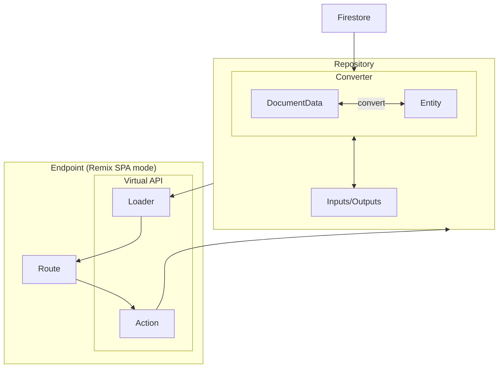

# cafeore-2024 POSシステム

## コマンド

| コマンド   | 説明                                  |
| ---------- | ------------------------------------- |
| `bun sync` | 依存パッケージのインストール          |
| `bun dev`  | 開発環境の立ち上げ                    |
| `bun tsc`  | TypeScriptの型チェックを実行          |
| `bun lint` | ESLintの実行。`--fix`をつけて自動修正 |
| `bun fmt`  | Prettierの実行                        |

## Architecture

