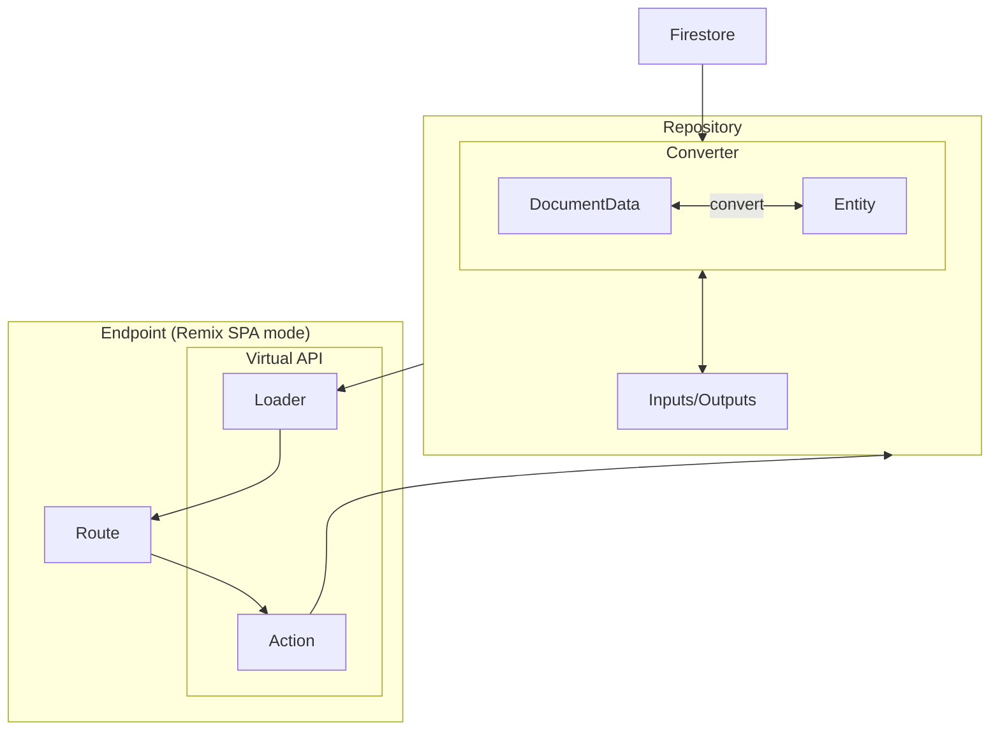

# cafeore-2024 POSシステム

## コマンド

| コマンド        | 説明                                        |
| --------------- | ---------------------------------------- |
| `bun sync`      | 依存パッケージのインストール                    |
| `bun dev`       | 開発環境の立ち上げ                            |
| `bun tsc`       | TypeScriptの型チェックを実行                  |
| `bun lint`      | Biome の lint & format のチェック           |
| `bun fmt`       | Biome による修正 `--unsafe` で破壊的な修正     |
| `bun test:unit` | 単体テスト                                  |
| `bun test:db`   | Firebase Emulatorsを使ったFirestoreのテスト  |

## Architecture

